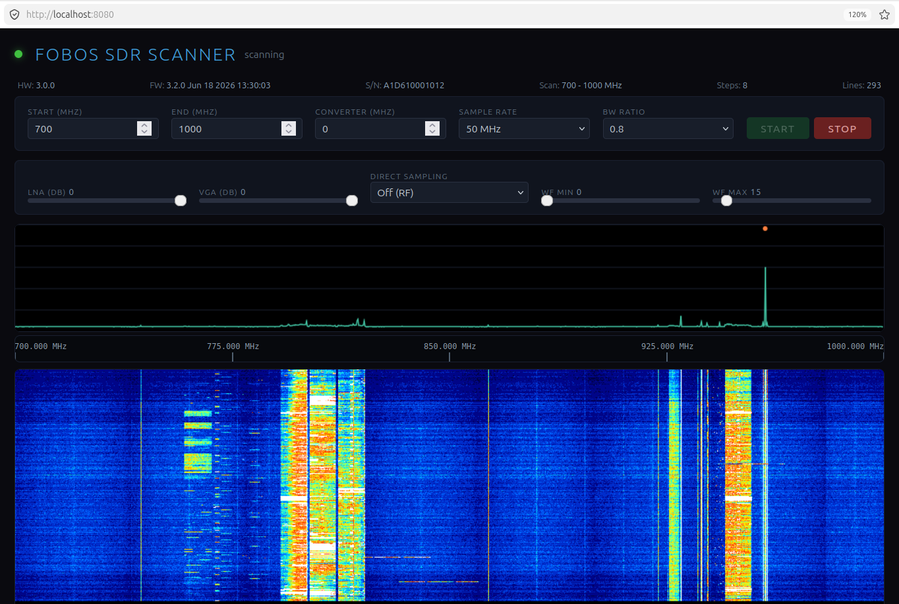

# Fobos SDR Scanner with a million times zoom

Browser-based spectrum and waterfall scanner for RigExpert Fobos SDR using the agile Fobos SDR API, where you can zoom in a million times.



The program runs a small C HTTP server on `localhost:8080`, controls the SDR through `libfobos_sdr`, and streams waterfall lines to the browser with Server-Sent Events. The scanner uses the Fobos hardware scan API to sweep a frequency list, queues SDR callback buffers, processes FFT magnitudes in a worker thread, and renders the current spectrum and waterfall in `index.html`.

## Features

- Hardware-assisted frequency scanning through `fobos_sdr_start_scan()`
- Live spectrum and top-to-bottom waterfall display
- `Shift + wheel` zoom for the spectrum and waterfall
- Keyboard zoom/pan shortcuts that leave browser `Ctrl++`, `Ctrl+-`, and `Ctrl+0` zoom controls untouched
- Saved zoom window restored on reload/autostart; pressing Start resets to the full band
- Hover readout for air frequency, receiver frequency when a converter is set, and spectrum level
- Adjustable LNA `0..3` and VGA `0..31` gain while scanning
- Converter frequency offset for upconverter/downconverter use
- Waterfall brightness window controls up to `400`
- Configurable frequency range, software bandwidth ratio, line-rate limit, and direct sampling mode with fixed 50 MHz sample rate
- Single-frequency super-zoom path using automatic 1024-65536 FFT sizing plus CIC decimation when the visible span is too narrow for a direct FFT
- Minimum line-rate control for decimated single-stream zoom using FFT-window overlap
- Editable `bands.ini` spectrum overlays
- Editable frequency markers using `Shift + left-click` or `Ctrl/Alt + right-click`
- Browser status heartbeat that shows `disconnected`, `idle`, or `scanning`, plus `SW: YYYYMMDD` from the running binary compile date
- Hardened flat-JSON control parser, explicit bad-request responses, validated marker saves, and throttled frontend view persistence

## Operation

The backend opens the device to read board information, starts the HTTP server, and waits for scan commands from the web UI. The frontend automatically starts a scan when the backend is available; if a scan is already running, it attaches to the existing Server-Sent Events stream instead of restarting it. If the browser is closed or stops talking to the backend, the active scan is stopped after about `20` seconds with no frontend HTTP heartbeat and no active waterfall SSE client.

The scan band is split into hardware scan points with:

```text
step = samplerate * bw_ratio
```

In the scanner, `bw_ratio` is a software scan/display ratio only. The backend requests exact full hardware bandwidth with `fobos_sdr_set_bandwidth(..., samplerate)`, which disables Fobos SDR hardware auto bandwidth without tying the hardware filter to software scan spacing.

The Fobos agile scan list is limited to `256` frequencies. If the requested band needs more points, the backend clamps the effective end frequency to the last covered frequency and returns that value to the frontend.

Hardware scan mode reads `98304` complex samples per scan point. This is above the agile API minimum of `65536`, giving slower receiver retunes enough dwell time to stop reporting "tuning incomplete" buffers at scan edges or tuner band transitions.

The backend also clamps the configured air-frequency range to receiver tuning limits after converter math. In RF-input mode the receiver center must stay from `50 MHz` through `6000 MHz`; with a converter enabled, the UI start/end values are adjusted so the resulting receiver frequencies remain inside that range before the 256-point scan clamp is applied.

All frontend frequencies are air/signal frequencies. Immediately before programming the SDR, the backend converts them to receiver frequencies:

```text
positive converter: receiver = radio - converter
negative converter: receiver = abs(-converter - radio)
```

Changing the FFT size uses `POST /api/fft`. It updates only backend FFT processing buffers and does not restart `fobos_sdr_start_scan()`, reset zoom, clear the waterfall, or change brightness settings.

When the visible span fits inside one scan point, the backend switches from hardware scan mode to normal single-frequency streaming. It chooses the smallest useful power-of-two FFT from `1024` through `65536`; at very high zoom it decimates the continuous I/Q stream with a 3-stage CIC decimator instead of using larger FFTs. This improves narrow-span frequency resolution without allocating one huge USB transfer buffer. In single-frequency mode the receiver center is shifted outside the visible span when possible, which moves the normal I/Q zero-frequency dip away from the middle of the screen.

Band overlays are loaded from:

```text
bands.ini
```

The file is human editable. Use one section per band with `name`, `start_mhz`, and `end_mhz`.

The backend persists the configured scan range and the current visible range in `fobos-scanner.conf`. Pressing Start from the UI intentionally resets the visible range to the full configured band unless the UI sends a preserved view.

Control endpoints accept flat JSON objects. Malformed JSON, invalid numeric fields, unsupported methods, oversized bodies, and invalid marker files return JSON error responses instead of being silently ignored.

## Mouse And Keyboard Controls

- Hover over the spectrum or waterfall to show the frequency. If a converter is configured, the popup also shows `RF:` and `RX:` frequencies; on the spectrum it also shows `Level:`.
- `Shift + mouse wheel` zooms the visible frequency span around the cursor.
- Left-drag on the spectrum or waterfall pans the visible frequency span.
- `Ctrl + left-drag` on the waterfall shows a temporary black/white dashed ruler with horizontal distance in kHz or MHz and vertical time difference in seconds.
- `Shift + left-click` or `Ctrl/Alt + right-click` opens the frequency marker editor.
- Plain `+`, `-`, left/right arrows, and `0` zoom, pan, and reset the app view. Browser zoom shortcuts `Ctrl++`, `Ctrl+-`, and `Ctrl+0` are left for the browser.

## Browser Traffic

The browser uses ordinary HTTP for the page, settings, and status, plus one long-lived Server-Sent Events stream for live spectrum/waterfall data.

Frontend to backend:

- `GET /`, `GET /bands.ini`, and `GET /markers.ini` load static UI data.
- `GET /api/status` is the heartbeat and parameter snapshot. The frontend polls it every `2` seconds.
- `POST /api/start`, `/api/view`, `/api/fft`, `/api/gain`, `/api/rate`, `/api/min-rate`, `/api/stop`, and marker save endpoints send control changes.
- `GET /api/waterfall` opens the SSE stream. After this request, the backend pushes live lines to the browser.

Backend to frontend:

- `/api/status` returns JSON with scan state, displayed frequency range, FFT/decimation settings, line-rate settings, and `traffic_kbytes_s`.
- `/api/waterfall` sends one SSE `line` event per displayed waterfall row. The same row is also used by the frontend as the latest spectrum trace.
- The frontend validates incoming SSE rows before rendering. Rows with malformed data or a stale `display_bins` width are ignored and trigger a debounced view/bin update.
- Each `line` event contains metadata plus `d`, an array of `display_bins` unsigned 8-bit magnitudes written as decimal JSON numbers:

```text
event: line
data: {"view":...,"n":...,"b":...,"mode":"scan|single",
       "f0":...,"f1":...,"full_f0":...,"full_f1":...,
       "visible_start_hz":...,"visible_end_hz":...,
       "display_bins":N,"source_bins":...,"effective_fft_size":...,
       "decim_factor":...,"decim_hop":...,"overlap_factor":...,
       "d":[v0,v1,...,vN-1]}
```

The backend reduces the processed FFT/source bins to exactly `display_bins` dots before sending the row. Values in `d` are text JSON, not binary bytes, so each magnitude costs `1` to `3` digit bytes plus commas.

For one SSE client, exact live waterfall traffic is:

```text
B_line = H + (N - 1) + sum(digits(v_i), i = 0..N-1)
T_sse_bytes_per_sec = R * B_line
T_sse_kbytes_per_sec = T_sse_bytes_per_sec / 1024
```

Where:

- `N` is `display_bins`.
- `R` is the delivered waterfall line rate after backend rate limiting, in lines/s.
- `v_i` is one magnitude value in `d`, from `0` to `255`.
- `digits(v_i)` is `1`, `2`, or `3`.
- `H` is the fixed SSE/JSON metadata overhead for that line, including `event: line`, field names, frequency values, and the final `]}\n\n`, but excluding magnitude digits and commas.

A practical estimate is:

```text
B_line ~= H + N * (avg_digits + 1) - 1
T_sse_kbytes_per_sec ~= clients * R * B_line / 1024
```

`avg_digits` is usually between `2` and `3`; worst case is `3`. The `traffic_kbytes_s` field shown by the frontend is not this estimate. It is measured in the backend from actual SSE bytes successfully written over the recent traffic window, and it multiplies naturally when multiple browser tabs are connected. It excludes most small request/response overhead such as `/api/status` polling and control POSTs.

## Dependencies

This project expects to be built inside the Fobos SDR workspace layout used by this repository:

```text
FobosSDR/
  fobos-scanner/
  libfobos-sdr-agile/
  local-agile/
```

The scanner uses these sibling folders as follows:

- `libfobos-sdr-agile/` is expected to be the agile Fobos SDR source and build tree.
  - Required header path: `../libfobos-sdr-agile/fobos/fobos_sdr.h`
  - Required runtime/link library after building the agile library: `../libfobos-sdr-agile/build-local/libfobos_sdr.so`
  - Optional pkg-config metadata from that build: `../libfobos-sdr-agile/build-local/libfobos_sdr.pc`
  - The scanner does not compile the library sources directly; it only includes `fobos_sdr.h` and links `-lfobos_sdr`.
- `local-agile/` is expected to be an optional install prefix for the same agile library.
  - Header path used by the Makefile if present: `../local-agile/include/fobos_sdr.h`
  - Runtime/link library path used by the Makefile and run scripts if present: `../local-agile/lib/libfobos_sdr.so`
  - Optional pkg-config metadata if installed there: `../local-agile/lib/pkgconfig/libfobos_sdr.pc`

Required tools and libraries:

- GCC with C99 support
- GNU Make
- POSIX threads
- math library (`libm`)
- `libusb-1.0`
- Fobos SDR agile headers and library
  - headers: `../libfobos-sdr-agile`, `../libfobos-sdr-agile/fobos`
  - library: `../libfobos-sdr-agile/build-local/libfobos_sdr`
- local agile dependency prefix, if used by your build
  - headers: `../local-agile/include`
  - libraries: `../local-agile/lib`

On Debian/Ubuntu, the system build tools and libusb headers are typically installed with:

```sh
sudo apt install build-essential libusb-1.0-0-dev
```

The Fobos SDR agile library must be built separately before building this scanner.

## Build

From the `fobos-scanner` directory:

```sh
make
```

The Makefile defaults to the sibling agile-library layout above. Override these paths when needed:

```sh
make FOBOS_SRC=/path/to/libfobos-sdr-agile \
     FOBOS_BUILD=/path/to/libfobos-sdr-agile/build-local \
     FOBOS_LOCAL=/path/to/local-agile
```

This produces:

```text
./fobos-scanner
./tools/fobos-stream-test
./tools/fobos-fq-response
```

To remove the built binary:

```sh
make clean
```

## Run

Use the included wrapper so the local Fobos SDR libraries are on `LD_LIBRARY_PATH`:

```sh
./run-scanner.sh
```

Or use the Makefile target:

```sh
make run
```

Then open:

```text
http://localhost:8080
```

The run wrappers also accept path overrides:

```sh
FOBOS_BUILD=/path/to/build-local FOBOS_LOCAL=/path/to/local-agile ./run-scanner.sh
```

## Stream Integrity Test

`fobos-stream-test` is a standalone receiver stream health checker. It opens the Fobos SDR in normal single-frequency async streaming mode, runs for a fixed time, and reports callback timing, inferred missing buffers, buffer length changes, repeated buffer signatures, non-finite samples, clipping, RMS/DC levels, boundary jumps, and observed sample throughput.

The Fobos agile public callback does not expose hardware sequence numbers, so missing/out-of-order buffers are inferred from callback cadence and timing gaps rather than from explicit buffer IDs.

Run with defaults, `100 MHz`, `50 MHz` sample rate, and `10` seconds:

```sh
./tools/run-stream-test.sh
```

Or use the Makefile wrapper:

```sh
make stream-test
```

## Frequency Response Calibration

`fobos-fq-response` measures the receiver passband shape with all antennas disconnected. It tunes many receiver center frequencies, repeats several passes, captures noise-only synchronous buffers at each center, FFTs and robust-averages them, clamps narrow peaks against a local baseline, smooths the result, optionally mirror-averages around DC, and writes an inverse-correction table for later frequency-domain compensation.

Run with defaults: `50 MHz` sample rate, `65536` FFT, 11 centers from `100` to `350 MHz`, `3` passes, `128` buffers per capture, LNA `2`, VGA `15`, and output prefix `fq_response`:

```sh
./tools/run-fq-response.sh
```

The program asks you to confirm that antennas and signal sources are disconnected. For automated runs:

```sh
./tools/run-fq-response.sh --yes --out-prefix my_response
```

The wrapper runs from the scanner directory even though it lives in `tools/`, so default output files are written next to the main program:

Outputs:

```text
my_response.txt
my_response.png
```

The text file is machine readable. Important columns are:

```text
offset_hz           baseband offset from -samplerate/2 to +samplerate/2
response_db         measured, smoothed passband response normalized to 0 dB mean
correction_db       inverse correction in dB
correction_linear   inverse amplitude multiplier, 10^(correction_db/20)
raw_avg_db          robust averaged response before final smoothing/symmetry
despurred_db        raw average after narrow upward peak clamping
```

When `fq_response.txt` is present in the scanner directory, the backend loads its smoothed `correction_linear` column on startup. The correction is applied only to hardware scan-mode FFT bins; single-frequency fixed/zoom mode is left unchanged. The table is FFT-shifted low-to-high: index `0` is `-Fs/2`, the middle row is DC, and the final row is `+Fs/2`. The backend indexes the table by physical baseband offset, using the calibration sample-rate metadata when present, so `BW ratio = 0.5` at the calibration sample rate uses the centered 50% of a `BW=1.0` calibration instead of compressing the full edge correction into the narrower scan slice. Values are interpolated for smaller FFT sizes and for the shorter final scan step.

Useful options:

```text
--centers-mhz 100,125,150,175,200,225,250,275,300,325,350
--samplerate 50M
--fft-size 65536
--buffers 128
--passes 3
--despur-khz 5000
--peak-clamp-db 0.25
--smooth-khz 3000
--lna 2
--vga 15
--no-symmetry
```

## Checks

Build with the default warning set:

```sh
make check
```

With the backend running, run HTTP/API smoke checks:

```sh
tools/http_smoke_test.sh
```

The smoke test covers the index page, `/api/status`, bad JSON field handling, invalid visible ranges, and 404 behavior.

Example custom run:

```sh
./tools/run-stream-test.sh --freq-mhz 315 --samplerate 50M --seconds 60
```

Useful options:

```text
--freq-mhz MHz
--freq-hz HZ
--samplerate HZ
--seconds SEC
--buf-len complex_samples
--buf-count N
--bw-ratio R
--lna N        LNA gain, 0..3
--vga N        VGA gain, 0..31
--clock internal|external
```

## Notes

- Default scan start frequency is `50 MHz`.
- The scanner sample rate is fixed at `50 MHz`; the frontend control is disabled and backend start requests ignore any other sample-rate value.
- Default software bandwidth usage in auto scan mode is `0.9`; IF frequency-response compensation is enabled by default when `fq_response.txt` is available.
- Auto waterfall levels are enabled by default on first page load.
- The backend listens on port `8080`.
- The scanner needs access to a connected Fobos SDR supported by the agile firmware/API.
- Gain sliders update the device live through `POST /api/gain`; LNA accepts `0..3`, VGA accepts `0..31`.
- FFT size updates live through `POST /api/fft`.
- Waterfall data is sent as compact `uint8` magnitude rows over Server-Sent Events.
- FFT magnitudes are Hann-window normalized and compensated to a `1024`-point FFT reference bandwidth so displayed signal levels stay comparable when FFT size changes.
- Scanner `BW USAGE IN AUTO SCAN MODE` does not narrow the Fobos hardware filter; scanner starts request exact full hardware bandwidth and disable hardware auto bandwidth.
- Waterfall rate options are saved in `fobos-scanner.conf`; defaults are minimum `10 lines/s` and maximum `20 lines/s`.
